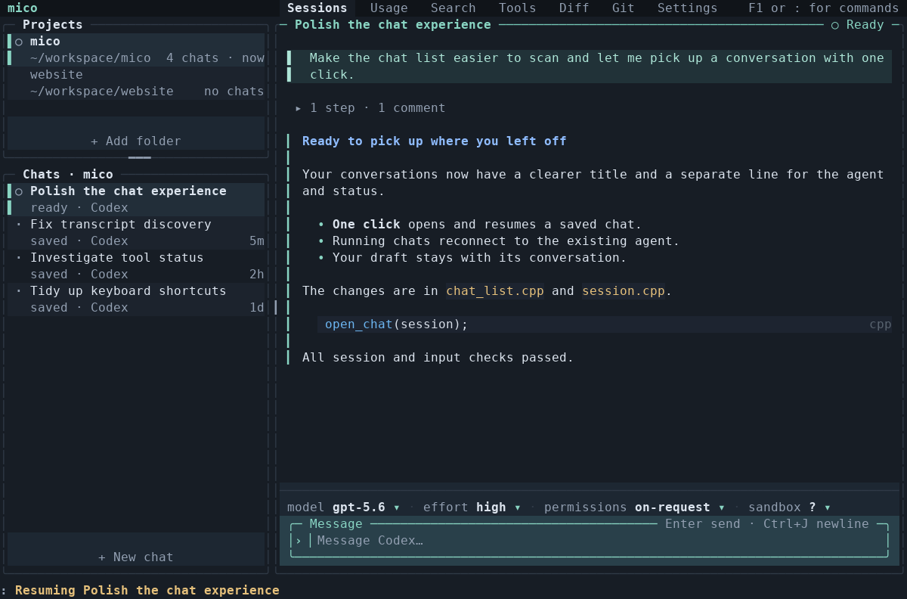
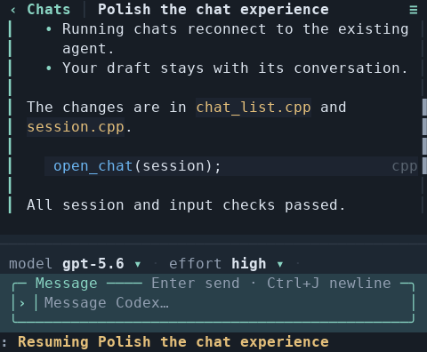

<p align="center"></p>

<h1 align="center">mico</h1>

<p align="center">
  <b>One terminal for all your coding agents.</b><br>
  Claude Code · Codex · pi · Oh My Pi
</p>

<p align="center">
  
</p>

mico runs your coding agents in the background and shows each one as a clean,
readable chat. You can switch between them, answer their questions and follow
what they change, all from one terminal, a phone over ssh or a browser.

It sits on top of the agents and does not replace them. mico never calls a
model API and never runs an agent loop. It doesn't write into the agents' own
files either, with one exception: it marks a folder as trusted for Claude
([details](docs/manual.md#new-sessions-in-a-new-folder)). If mico stops, your
agents keep running.

## Highlights

- **Agents keep running.** A background daemon holds every agent, so closing
  the terminal, losing ssh or shutting the laptop doesn't stop them. After a
  reboot or crash, the next daemon resumes the conversations.
- **A chat view or the real terminal.** mico draws each chat from the agent's
  own transcript. `F2` switches to the agent's actual terminal and back.
- **Rich output.** Markdown, tables, syntax-coloured code and diffs, pictures,
  typeset LaTeX, charts, Mermaid diagrams, Jupyter notebooks and collapsible
  JSON.
- **Answer without leaving the chat.** Questions and permission prompts show
  up as cards you can click. Chips under the chat change the model, effort and
  mode.
- **See what happened.** Separate tabs cover **Usage** (cost, tokens, rate
  limits), **Search**, **Tools**, **Diff** (each file change and the chat that
  made it) and **Git** (branches, worktrees, commits and the chat behind each).
- **Works anywhere.** Below 80 columns the layout switches to one pane at a
  time for phones. A web page on localhost can also be reached through
  Tailscale.
- **Notifications** when an agent finishes or needs you, in the terminal's own
  style (kitty, Ghostty, WezTerm, iTerm2 and others) or on the desktop.
- **Fast and self-contained.** It opens a 200 MB transcript in under a
  millisecond and uses no CPU while idle. There are no third-party
  dependencies.

<p align="center"></p>

## Getting started

**From source.** You need Linux, CMake 3.20 or newer, Ninja and a C++23
compiler (GCC 13 or Clang 18).

```sh
git clone https://github.com/AmedeoBiolatti/mico && cd mico
cmake -S . -B build -G Ninja && cmake --build build
cmake --install build    # copies mico to ~/.local/bin; no root needed
mico
```

`--prefix DIR` installs somewhere else. After a rebuild, install again and run
`mico kill`, so the next daemon runs the new copy.

**From a release.** Each release has a binary for x86-64 Linux, built on
Ubuntu 24.04 (it runs there and on newer systems, WSL2 included). Check it
before running it: the checksum says the download is whole, the attestation
that GitHub built it from this repository's source.

```sh
gh release download -R AmedeoBiolatti/mico -p 'mico-*.tar.gz' -p SHA256SUMS
sha256sum -c SHA256SUMS
gh attestation verify mico-*.tar.gz -R AmedeoBiolatti/mico
tar -xzf mico-*.tar.gz && install -Dm755 mico-*/bin/mico ~/.local/bin/mico
```

`mico` attaches to the daemon and starts one if none is running. Press `q` or
close the terminal to detach: your agents keep running.

| command | |
|---|---|
| `mico` | attach, starting a daemon if needed |
| `mico --attach` | attach only; fail if no daemon is running |
| `mico kill` | stop the daemon and its agents (the next daemon resumes them) |
| `mico --local` | single process; agents stop when it exits |

## Keys

| key | |
|---|---|
| `F7` | new agent: choose `claude`, `codex`, `pi`, `omp` or any command, then a folder |
| `Ctrl-K` · `F12` | jump to any chat, in any folder |
| `Ctrl-G` | outline of this chat: your messages, edits, failures, questions |
| `F2` | switch between the chat and the agent's real terminal |
| `F6` | fork the selected chat |
| `Alt-1` · `Alt-2` · `Alt-3` | focus folders · chats · the message box |
| `:` · `F1` | mico's command line (`:help` lists everything) |
| `[` · `]` | previous / next tab |
| `F8` | give the mouse back to your terminal for native selection |
| `q` · `F10` | detach |

Use the mouse for everything else. Click a chat to open or resume it, drag to
copy text, drag a divider to resize panes and right-click for a menu. Function
keys work even inside a raw agent terminal, which receives every other key.

## Supported agents

| agent | chat view | fork | sessions found in |
|---|---|---|---|
| **Claude Code** | ✓ | ✓ | `$CLAUDE_CONFIG_DIR`, `~/.claude` |
| **Codex** | ✓ | ✓ | `$CODEX_HOME`, `~/.codex` |
| **pi** | ✓ | ✓ | `$PI_CODING_AGENT_DIR`, `~/.pi` |
| **Oh My Pi** (`omp`) | ✓ | resumes in place | `$PI_CODING_AGENT_DIR`, `$OMP_PROFILE`, `~/.omp` |

Any other command can also run in a pane as a plain terminal. Adding an agent
means adding one directory under `src/adapters/` and one line in
`registry.cpp`.

## How it works

```
 your terminal(s)        mico daemon                       agents
 ┌────────────┐  keys   ┌──────────────────────────┐  pty  ┌────────┐
 │ mico client│ ──────▶ │ terminal emulator        │ ◀───▶ │ claude │
 │            │ ◀────── │ transcript reader        │ ◀──── │ codex  │
 └────────────┘  frames │ renderer                 │ jsonl │ pi/omp │
 ┌────────────┐  json   │                          │       └────────┘
 │  browser   │ ◀─────▶ │ state protocol (ws)      │
 └────────────┘         └──────────────────────────┘
```

The daemon reads each agent from two sources at once: its pseudo-terminal and
its transcript file. The chat view comes from the transcript. The terminal
shows the live screen, so mico can catch dialogs and replies before they are
saved. Clients only forward keystrokes and draw the frames they get back, so
several terminals can watch the same session.

## Learn more

The [full manual](docs/manual.md) covers every feature in detail, including
[the chat view](docs/manual.md#the-chat-view), [settings](docs/manual.md#settings),
[commands](docs/manual.md#commands), [the web view](docs/manual.md#web-view),
[phones](docs/manual.md#on-a-phone), [notifications and resuming](docs/manual.md#while-you-are-away),
[logs](docs/manual.md#logs), [performance](docs/manual.md#performance) and
[the source layout](docs/manual.md#source-layout).

## Development

```sh
ctest --test-dir build --output-on-failure   # every test, each in its own HOME
./build/mico --selftest                      # parsers, renderers, adapters
./build/mico --bench                         # scan, open, frame and scroll timings
python3 tests/render_preview.py out/         # render the UI to PNGs (needs Pillow)
```

None of the tests start a real coding agent. CI builds with GCC 13 and
Clang 18 on pushes to `main` and on pull requests.

## License

[MIT](LICENSE).
